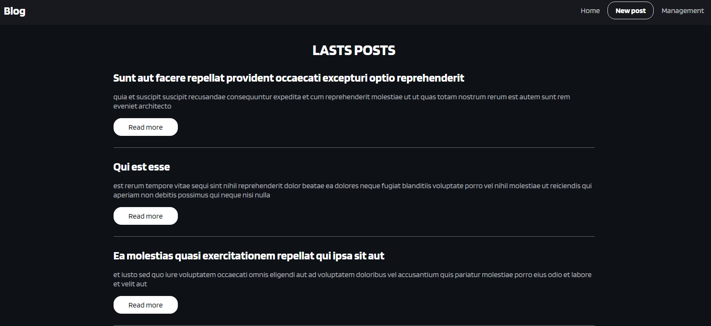
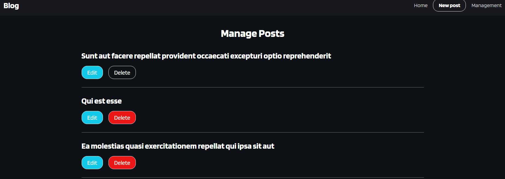

# (Blog)

This is a [Blog](project link). 

## Table of contents

- [Overview](#overview)
  - [The purpose](#The-purpose)
  - [Screenshot](#screenshot)
- [My process](#my-process)
  - [Built with](#built-with)
  - [What I learned](#what-i-learned)
  - [Continued development](#continued-development)
  - [Useful resources](#useful-resources)
- [Author](#author)

## Overview

### The-purpose

Users should be able to:

- Access posts from page home
- In new post you can create a new post
- In management you can edit or delete a post

### Screenshot

## My process

### Built with

- jsonplaceholder API
- Axios
- React-router-dom
- Semantic HTML5 markup
- CSS custom properties
- [React](https://reactjs.org/) - JS library

### What I learned

A better usage of router-dom

## Author

- Website - [Leandro](https://leandro-pixel.github.io/React-Portfolio/)
- Linkdin - [@Leandro-Soares-Neves](https://www.linkedin.com/in/leandro-soares-neves/)
